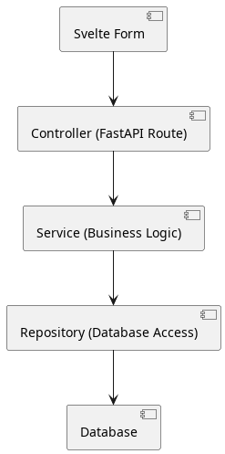

# Controller-Service-Repository Pattern & CRUD: An Overview

## Introduction

Modern web applications often separate concerns into distinct layers to improve maintainability, testability, and scalability. One popular approach in the backend is the controller-service-repository pattern. This pattern is especially useful for applications with complex business logic and database interactions. We are aiming to comply with this design pattern in the project.

A server that serves a Svelte frontend can use this pattern to handle requests—especially those involving sensitive information — securely and efficiently.

## The Layers Explained

1. **Controller**

   - **Role:** Handles HTTP requests and responses.
   - **Responsibility:** Receives input from the client (e.g., a Svelte form), calls the appropriate service methods, and returns the result.
   - **Example:** The controller defines endpoints such as `/api/auth/register` and `/api/auth/login`. These endpoints receive user data, call the service layer, and return JSON responses.
   - **Error Handling:** Exceptions are mainly caught at the controller level. The controller always returns valid JSON to the frontend, including appropriate error messages when necessary, while avoiding leaking sensitive information.

2. **Service**

   - **Role:** Contains business logic.
   - **Responsibility:** Implements the core functionality of the application, such as validating credentials, generating tokens, or sending emails. It orchestrates calls to the repository and other utilities.
   - **Example:** The service layer handles password hashing, verification code generation, and calls to the repository for user data. It may also send emails after successful registration or code updates.

3. **Repository**

   - **Role:** Manages data persistence.
   - **Responsibility:** Handles all interactions with the database. It provides methods for CRUD operations (Create, Read, Update, Delete) on data models.
   - **Example:** The repository provides methods like `get_user_by_email`, `create_user`, `verify_code`, and `update_code` to interact with the `users` table in the database.

## CRUD Operations

CRUD stands for Create, Read, Update, Delete—the four basic operations for persistent storage.

- **Create:** Add new records (e.g., registering a new user).
- **Read:** Retrieve records (e.g., fetching a user by email).
- **Update:** Modify existing records (e.g., updating a verification code).
- **Delete:** Remove records (for example, deleting a user).

### Example: Authentication Flow

1. **Register (Create)**
    - Controller: Receives registration data from the Svelte frontend.
    - Service: Hashes the password, generates a verification code, and calls the repository to create the user.
    - Repository: Inserts the new user into the database.

2. **Login (Read)**
    - Controller: Receives login credentials.
    - Service: Fetches the user by email and verifies the password.
    - Repository: Retrieves the user record from the database.

3. **Verify Email (Update)**
    - Controller: Receives a verification code.
    - Service: Calls the repository to update the user's verification status.
    - Repository: Updates the `is_verified` field in the database.

## Why Use Controller-Service-Repository Pattern?

- **Separation of Concerns:** Each layer has a single responsibility, making the codebase easier to understand and maintain.
- **Testability:** Business logic can be tested independently from HTTP and database layers.
- **Reusability:** Services and repositories can be reused across different controllers or even applications.
- **Security:** Sensitive operations (like authentication) are handled server-side, reducing exposure to the client.
- **Consistent Error Handling:** Exceptions are caught at the controller level, and valid JSON responses are always returned to the frontend, including appropriate error messages without leaking sensitive details.

## How It Works with Svelte

A Svelte frontend can use form actions and server-side calls for sensitive or restricted operations. When a user submits a form (such as login or register), the request is sent to the FastAPI backend, which processes it through the controller-service-repository pipeline. This ensures data is validated, business rules are enforced, and database operations are performed securely.

## Summary Diagram

This pattern helps build robust, maintainable, and secure web applications, especially when handling authentication and other sensitive operations.