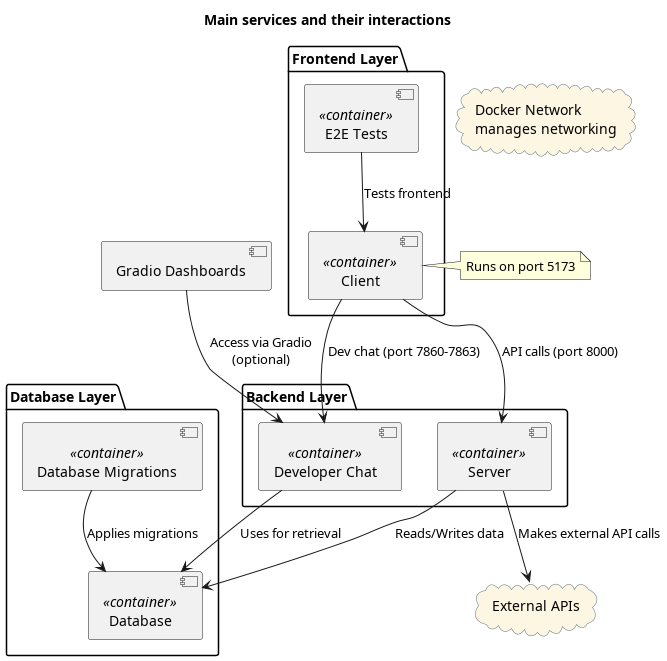

# Project Overview

This is a software development project for Taitotalo's Python programmer course. We develop a web application using container technology, with Svelte and JavaScript frontend (using deno), FastAPI backend, Postgres database with vector extension, Flyway migrations, Playwright e2e-tests, Pytest backend tests, and a chat-engine (HuggingFace, Langchain and OpenAI). A concise description of the project is given in this document, but more technical information can be found from `./App/README.md`.

## Application Overview

Eprice is an application that show users market electricity price and additional related information, such as electricity consumption and production. For non-registered users, only the current 24 hour period is covered, and only the market price is shown. For registered users, also historical data is available for market price and for production/consumption. The data is represented with graphs and statistics.

For registered users there is also a chat-engine available, which has access to specific source material, and which augments the user queries with retrieved context information. 

---

## Services Overview

The system consists of multiple containerized services that work together to provide functionality for the Eprice application, including a database, backend server, client application, and additional components for migrations, testing, and a chat engine.

### 1. Database
- **Ports**: `5432` (default PostgreSQL port)
- **Purpose**: Stores application data, including user information and embeddings for retrieval.

### 2. Database Migrations
- **Purpose**: Handles database schema migrations.
- **Depends On**: `Database`

### 3. Server
- **Ports**: `8000`
- **Purpose**: Provides backend APIs for the client and other services.
- **Depends On**: `Database`
- **Additional Functionality**: Makes external API calls.

### 4. Client
- **Ports**: `5173` (Svelte client)
- **Purpose**: Frontend application for user interaction.
- **Depends On**: `Server`, `Chat Engine`

### 5. E2E Tests
- **Purpose**: Runs end-to-end tests for the system.
- **Depends On**: `Client`

### (Extra) Chat Engine
- **Ports**: `7860-7861`
- **Purpose**: Provides a chat engine for interaction with the project. This is meant for developers and maintainers, not the app's end-users. Chat uses retrieval augmented generation, and the retriever has access to project documentation and code. There are 2 distinct clients: A traditional streaming chat, and an Agent (for more complex reasoning tasks).
- **Depends On**: `Database`

---

## Main services and their interactions

## Additional Services Overview

### Data-preparation

- **Purpose**: Can be used independently to retrieve or update data. Saves data to a location that is available to migrations and the database.

### Backend-tests

- **Purpose**: Can be used to test backend functionality independently from the frontend. Beyond fault testing, backend-tests also give additional information and warnings which would be hidden from the e2e-tests.
- **Depends On**: Database and Server.

The backend tests are mainly for development purposes, as the e2e-tests should cover the main functionalities by the end of development.
