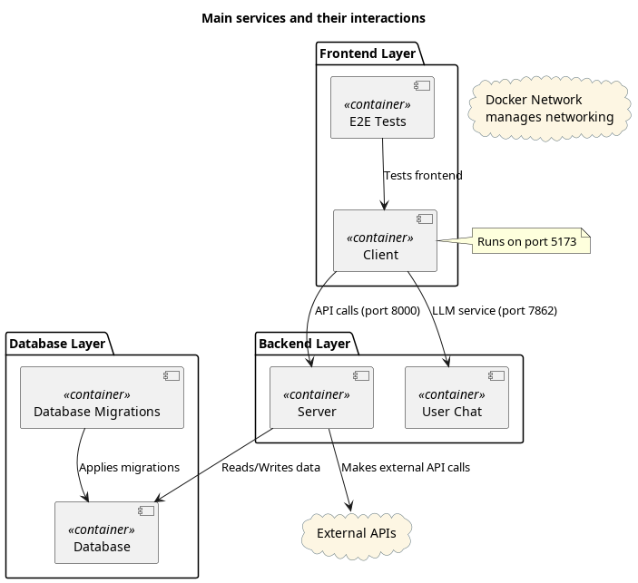

# Projektin yleiskuvaus

Tämä on ohjelmistokehitysprojekti Taitotalon Python-ohjelmoijan kurssille. Kehitämme web-sovelluksen, joka hyödyntää konttiteknologiaa. Frontend on toteutettu Svelte- ja JavaScript-teknologioilla (käyttäen deno:a), ja backend FastAPI:lla. Tietokantana toimii Postgres vektorilaajennuksella, ja skeemamuutokset hoidetaan Flyway-migraatioilla. Päättymistestit tehdään Playwrightilla ja backendin yksikkötestaus Pytestillä. Projektissa on myös chat-engine, joka hyödyntää HuggingFacea, Langchainia ja OpenAI:ta.

Tässä dokumentissa annetaan tiivis kuvaus projektista, mutta tarkempi tekninen dokumentaatio löytyy tiedostosta ./App/README.md.

## Sovelluksen yleiskuvaus

Eprice on sovellus, joka näyttää käyttäjälle pörssisähkön hinnan ja siihen liittyvää lisätietoa, kuten sähkönkulutusta ja -tuotantoa. Rekisteröitymättömille käyttäjille näytetään vain kuluvan vuorokauden markkinahinta. Rekisteröityneet käyttäjät saavat myös historiallisen datan näkyviin — sekä markkinahinnan että tuotannon ja kulutuksen osalta. Tiedot esitetään graafisesti ja tilastollisesti.

Rekisteröityneet käyttäjät voivat myös käyttää chat-engineä, joka hyödyntää projektin omaa lähdemateriaalia ja täydentää käyttäjän kysymyksiä kontekstuaalisella tiedolla.

---

## Palveluiden yleiskuvaus

Järjestelmä koostuu useista kontitetuista palveluista, jotka toimivat yhdessä Eprice-sovelluksen tarjoamiseksi. Näihin kuuluvat tietokanta, backend-palvelin, käyttöliittymä, sekä lisäkomponentit migraatioihin, testaukseen ja chattiin.

### 1. Database
- **Portti**: 5432 (PostgreSQL:n oletusportti)
- **Tarkoitus**: Tallentaa sovelluksen dataa, mukaan lukien käyttäjätiedot ja hakua varten käytettävät embeddingit.

### 2. Database Migrations

- **Tarkoitus**: Hallitsee tietokannan skeemamuutoksia.
- **Riippuu**: Database

### 3. Server
- **Portti**: 8000
- **Tarkoitus**: Tarjoaa backend-API:t käyttöliittymälle ja muille palveluille.
- **Riippuvuu**: Database
- **Lisätoiminto**: Tekee ulkoisia API-kutsuja.

### 4. Client
- **Portti**: 5173 (Svelte-käyttöliittymä)
- **Tarkoitus**: Frontend-sovellus käyttäjän vuorovaikutukseen.
- **Riippuvuu**: Server, Chat Engine

### 5. E2E Tests
- **Tarkoitus**: Suorittaa järjestelmän päättymistestit.
- **Riippuvuu**: Client

## Lisäpalveluiden yleiskuvaus

### Chat Engine (for: Developer Chat)
- **Portit**: 7860–7861
- **Tarkoitus**: Tarjoaa chat-moottorin projektin sisäiseen vuorovaikutukseen. Tämä on suunnattu kehittäjille ja ylläpitäjille, ei sovelluksen loppukäyttäjille. Chat perustuu retrieval augmented generation -menetelmään, ja siinä käytetty retriever saa käyttöönsä projektin dokumentaation ja koodin. Palvelussa on kaksi erillistä clientia: perinteinen streamaava chat ja Agent, joka on tarkoitettu monimutkaisempaan päättelyyn.
- **Riippuvuudet**: Database

### Data-preparation
- **Tarkoitus**: Voidaan käyttää itsenäisesti datan hakemiseen tai päivittämiseen. Tiedot tallennetaan sellaiseen sijaintiin, joka on migraatioiden ja tietokannan saatavilla.

### Backend-tests
- **Tarkoitus**: Mahdollistaa backend-toimintojen testauksen riippumatta frontendistä. Vianmäärityksen lisäksi testit tuottavat lisätietoa ja varoituksia, jotka eivät välttämättä näy e2e-testeissä.
- **Riippuvuudet**: Database ja Server

Backend-testit on tarkoitettu ensisijaisesti kehitysvaiheeseen. Varsinaiset päätoiminnot pyritään kattamaan e2e-testeillä kehityksen loppuun mennessä.

## Pääpalvelut ja niiden vuorovaikutus

