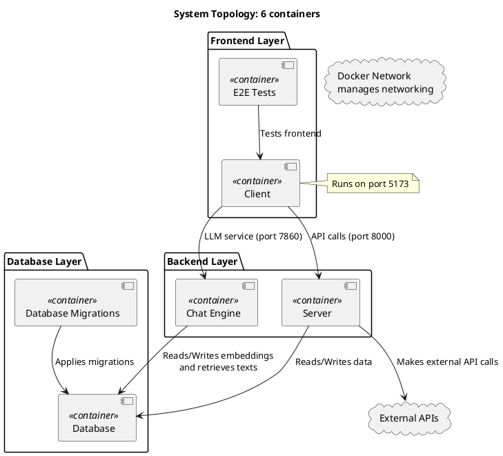

# System Topology

This document describes the basic topology of the system (as defined in the compose.yaml file). The system consists of multiple services that work together to provide functionality, including a database, backend server, client application, and additional components for migrations, testing, and a chat engine.

---

## Services Overview

### 1. Database
- **Ports**: `5432` (default PostgreSQL port)
- **Purpose**: Stores application data, including user information and embeddings for retrieval.

### 2. Database Migrations
- **Purpose**: Handles database schema migrations.
- **Depends On**: `Database`

### 3. Server
- **Ports**: `8000`
- **Purpose**: Provides backend APIs for the client and other services.
- **Depends On**: `Database`
- **Additional Functionality**: Makes external API calls.

### 4. Client
- **Ports**: `5173` (Svelte client)
- **Purpose**: Frontend application for user interaction.
- **Depends On**: `Server`, `Chat Engine`

### 5. E2E Tests
- **Purpose**: Runs end-to-end tests for the system.
- **Depends On**: `Client`

### 6. Chat Engine
- **Ports**: `7860`
- **Purpose**: Provides a chat engine for interaction with the system.
- **Depends On**: `Database`

---

